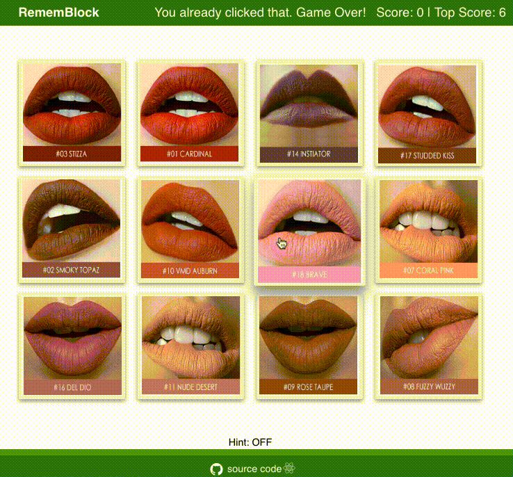

# RememBlock - a memory game

### Game Rules
- Click a block earn points, don't click a block more than once.
- Every time a block is clicked, the blocks shuffle in a random order.
- You get one point every time you click.
- Game over if there is an incorrect guess. A new game will start.
- You can turn on **hints** at the bottom if you lose your memory :)

So try to remember what have been clicked, and have fun!

### Under the hood
- Bootstrapped with [Create React App](https://github.com/facebook/create-react-app)
- Written in JSX with React components
- Use states, props and callbacks to pass data between components

